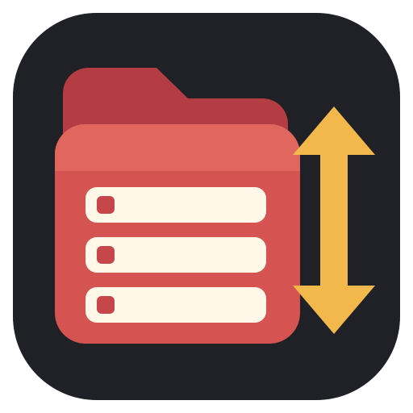

<p align="center">
  
</p>

<h1 align="center">Collection Sorter for Zotero</h1>

<p align="center">
  为 Zotero 的每个父分类独立设置直接子分类的显示顺序。<br>
  小巧、本地化、跨平台，并且只改变界面显示。
</p>

<p align="center">
  <a href="README.md"><strong>English</strong></a>
  ·
  <a href="#安装">安装</a>
  ·
  <a href="#使用方法">使用方法</a>
  ·
  <a href="#兼容性">兼容性</a>
  ·
  <a href="https://github.com/wadaxiyang/zotero-collection-sorter/releases">版本发布</a>
</p>

<p align="center">
  <a href="https://github.com/wadaxiyang/zotero-collection-sorter/releases/latest"></a>
  <a href="https://github.com/wadaxiyang/zotero-collection-sorter/actions/workflows/release.yml"></a>
  <a href="https://github.com/wadaxiyang/zotero-collection-sorter/releases"></a>
  <a href="https://www.zotero.org/"></a>
  <a href="LICENSE"></a>
</p>

> [!NOTE]
> 这是一个非官方第三方插件，与 Zotero 官方及 Corporation for Digital Scholarship 无隶属关系。

## 项目简介

Collection Sorter 为 Zotero 左侧分类树增加一个专注的能力：每个具体 Collection 都可以独立控制其**直接子分类**的显示顺序。

```text
子分类排序
├─ Zotero 默认
├─ 名称升序 A → Z
└─ 名称降序 Z → A
```

例如，你可以让会议分类中的年份降序显示，同时让每个年份下面的会议名称保持升序：

```text
01_Conference          [名称降序]
├─ 2026                [名称升序]
│  ├─ AAAI
│  ├─ ACL
│  ├─ CVPR
│  ├─ ICASSP
│  └─ ICLR
├─ 2025
└─ 2024
```

插件并不理解年份、会议、期刊或命名规范，只使用 Zotero 自身的语言排序规则比较 Collection 名称。

## 主要功能

- **每个父分类独立设置**：不同父 Collection 可以使用不同规则。
- **只影响直接子分类**：规则不会继承，也不会递归传播。
- **三种明确模式**：Zotero 默认、名称升序、名称降序。
- **增量更新立即生效**：新建、重命名、移动和同步新增都会使用目标父分类的规则。
- **冷启动顺序修复**：Zotero 恢复展开状态后，局部重建已展开且设置过规则的父分类。
- **父分类改名后仍有效**：规则使用稳定的 `libraryID:collectionKey` 标识。
- **语言自动跟随 Zotero**：中文环境显示中文，其他语言环境显示英文。
- **配置仅保存在本机**：不写入 Zotero Sync。
- **同一份跨平台 XPI**：运行时代码不含平台专属 API 或路径。

## 安装

1. 从 [**Releases 页面**](https://github.com/wadaxiyang/zotero-collection-sorter/releases/latest)下载最新 `.xpi`。
2. 在 Zotero 中打开 **工具 → 插件**。
3. 打开齿轮菜单，选择 **Install Plugin From File…**，或将 XPI 拖入插件窗口。
4. 右键点击具体 Collection，打开 **子分类排序**。

<p align="center">
  <a href="https://github.com/wadaxiyang/zotero-collection-sorter/releases/latest"><strong>下载最新版本 →</strong></a>
</p>

直接安装新版 XPI 即可升级，本地保存的排序规则不会丢失。

## 使用方法

1. 右键点击需要控制直接子分类顺序的父 Collection。
2. 打开 **子分类排序**。
3. 选择 **Zotero 默认**、**名称升序 A → Z** 或 **名称降序 Z → A**。

父分类已经展开时会立即局部重排；父分类处于折叠状态时，下次展开自动使用所选规则。选择 **Zotero 默认** 会删除该父分类保存的插件映射。

## 兼容性

| 组件 | 状态 |
| --- | --- |
| Zotero Desktop `9.0.x` | **支持** |
| Zotero `9.0.6` | **已测试**，目前验证的最新版本 |
| Windows | **已测试** |
| macOS | **已测试** |
| Linux | 代码不依赖平台专属 API，但**尚未实机测试** |
| Zotero 7 / Zotero 8 | **未测试且当前未声明兼容** |

manifest 目前只声明兼容 Zotero `9.0.*`。最初的内部源码核对基线为 Zotero 9.0.4（BuildID `20260522110811`），目前已经在 Windows 和 macOS 上实际验证至 Zotero 9.0.6。

由于插件会以最小范围调用 CollectionTree 内部方法，因此兼容性声明保持谨慎。如果未来缺失必要 API，插件会 fail closed，不会启用危险的降级方案。

## 语言行为

插件直接跟随 `Zotero.locale`，不增加独立设置页面：

- Zotero locale 为 `zh-*`：菜单显示中文。
- 其他任意 Zotero locale：菜单显示英文。

插件管理器中的名称和简介提供英文、简体中文和繁体中文资源。

## 安全边界

Collection Sorter 只改变分类树的显示顺序。它不会：

- 修改 Collection 名称、层级或元数据；
- 修改文献、PDF、附件或笔记；
- 创建隐藏 Collection、Item 或数据库表；
- 将插件设置写入 Zotero Sync；
- patch `Zotero.Collections.getByParent()` 或替换 `Zotero.localeCompare()`；
- 重载或刷新整棵 Collection Tree；
- 改变根 Library、Saved Search 或虚拟分类。

如果插件被禁用或无法运行，分类树只会恢复成 Zotero 默认顺序，用户数据不会受到影响。

## 开发

### 环境要求

- [Node.js 20+](https://nodejs.org/)
- 提供 `zip` 命令的 Shell 环境

### 测试和构建

```bash
npm test
bash scripts/build-xpi.sh
```

构建产物位于：

```text
dist/zotero-collection-sorter-<version>.xpi
```

项目没有运行时依赖，也不使用 TypeScript、Webpack、React 等构建框架。

### 自动发布

[GitHub Actions](https://github.com/wadaxiyang/zotero-collection-sorter/actions/workflows/release.yml) 负责发布流程：

- 手动运行 Workflow：测试并构建项目，上传 XPI 和 SHA-256 artifact。
- 推送匹配的 `v*` 标签：在以上步骤完成后自动创建 GitHub Release。

```bash
# 先更新 manifest.json 和 package.json
git tag v0.1.3
git push origin v0.1.3
```

标签版本必须与 manifest 完全一致。

## 项目结构

```text
.
├─ .github/                  # Release 工作流和发布说明
├─ _locales/                # 插件管理器本地化资源
├─ assets/                  # 项目 SVG 和打包使用的 PNG 图标
├─ scripts/build-xpi.sh     # 无依赖 XPI 打包脚本
├─ src/
│  ├─ localization.js       # 中英文运行时菜单文案
│  ├─ plugin.js             # 生命周期、菜单与 Tree patch
│  ├─ rule-store.js         # 本地配置校验与缓存
│  └─ sort-engine.js        # 仅名称比较逻辑
├─ test/                    # Node.js 回归测试
├─ bootstrap.js
├─ manifest.json
└─ prefs.js
```

实现和兼容性核对见 [**开发说明**](DEVELOPMENT.md)，回归矩阵见 [**测试记录**](TESTING.md)。

## 本地配置

插件只保存一个本地 preference：

```text
extensions.zotero.collectionSort.rules
```

示例：

```json
{
  "1:ABCDEFGH": "desc",
  "2:JKLMN123": "asc"
}
```

损坏的 JSON 或不受支持的模式会被安全忽略。

## 已知限制

- 规则不会在设备之间同步。
- 不支持自然数字排序、年份识别、多键排序或自定义拖拽顺序。
- Zotero 7、Zotero 8 和 Linux 尚未实机测试。
- Zotero 大版本或 CollectionTree 内部实现变化后需要重新核对兼容性。
- 尚未配置插件自动更新；请手动安装新版 XPI。

## 参与贡献

欢迎提交清晰、聚焦的 Issue 和 Pull Request：

- [**报告问题**](https://github.com/wadaxiyang/zotero-collection-sorter/issues/new)
- [**查看现有 Issue**](https://github.com/wadaxiyang/zotero-collection-sorter/issues)
- [**浏览项目源码**](https://github.com/wadaxiyang/zotero-collection-sorter)

报告分类树顺序问题时，请提供 Zotero 版本、操作系统、父子分类结构、选择的排序模式，以及问题发生在启动阶段还是增量更新阶段。

## 开源许可

Collection Sorter for Zotero 使用 [**MIT License**](LICENSE)。

<p align="center">
  <a href="#collection-sorter-for-zotero">返回顶部 ↑</a>
</p>
